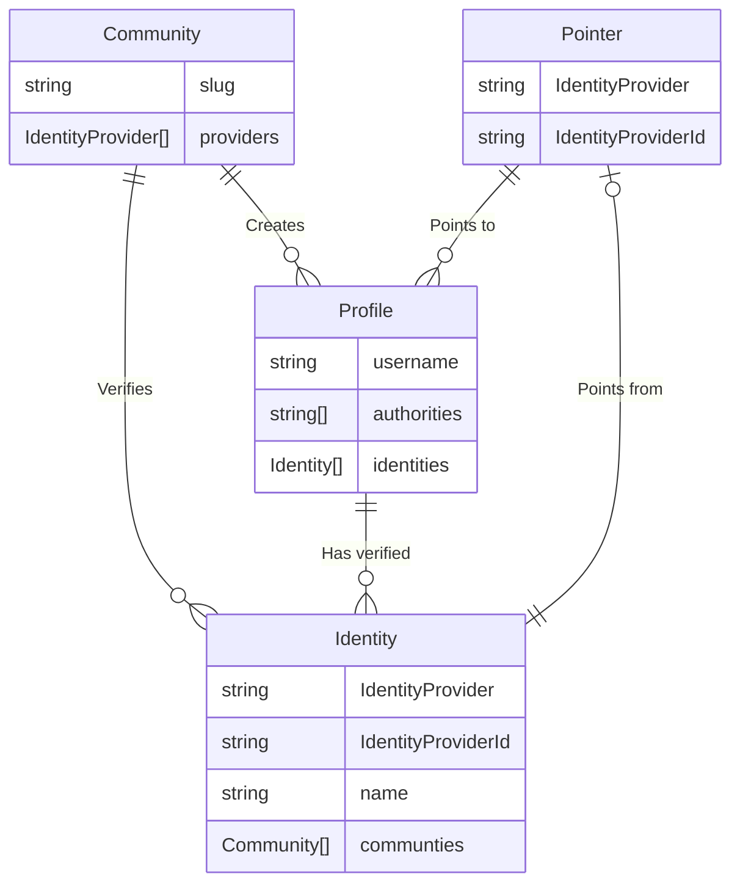

# PubKey Protocol (PPL)

> This is a work in progress.

PubKey Protocol is the social layer on Solana. It allows users to create and manage a profiles and verify their Social or Solana identities. The identities are verified by the communities in the network.

For more information [join our Discord](https://discord.gg/XxuZQeDPNf) or reach out to [@pubkeyapp on X](https://x.com/pubkeyapp).

## Glossary

The following terms are used throughout the documentation and code:

### Community

A _Community_ is an account that represents a team or project that creates _Profiles_ and verifies their _Identities_.

### Profile

A _Profile_ is an account that represents a user and their verified _Identities_.

### Identity

An _Identity_ is a Social or Solana identity that is verified by one or more _Communities_.

### IdentityProvider

An _IdentityProvider_ represents the origin of an Identity.

### IdentityProviderId

An _IdentityProviderId_ is the unique remote identifier for an _IdentityProvider_.

### Pointer

A _Pointer_ is an account that maps an _Identity_ to a _Profile_ based on the _IdentityProvider_ and _IdentityProviderId_.

## Identity Providers

The following identity providers are supported or in active development:

- Discord
- Github
- Google
- Solana
- Twitter
- X

The following identity providers are planned or need investigation:

- Farcaster
- Telegram

## Architecture

The following diagram shows the relationships between the different entities in PubKey Protocol:



## Getting Started

### Prerequisites

- [Node.js](https://nodejs.org/en/) (v20 or higher)
- [PNPM](https://pnpm.io/) (v8 or higher)
- [Rust](https://www.rust-lang.org/)
- [Anchor](https://www.anchor-lang.com/)
- [Git](https://git-scm.com/)

> [!TIP]
> If you don't have PNPM installed, you can install it using `corepack`:
>
> ```sh
> corepack enable
> corepack prepare pnpm@latest --activate
> ```

### Installation

1. Clone the repository:

```sh
git clone https://github.com/pubkeyapp/pubkey-protocol
cd pubkey-protocol
pnpm install
```

### Development

Start web app

```sh
pnpm dev:web
```

### Build

Build web app

```sh
pnpm build:web
```

Build the Anchor program

```sh
pnpm build:anchor
```

### Lint

Lint all projects

```sh

pnpm lint
```

### Test

Test all projects

```sh
pnpm test
```

To iterate on the `anchor` program using a local validator, this is the recommended workflow:

Open this in one terminal:

```shell
pnpm anchor localnet
```

And this in another:

```shell
pnpm anchor test --skip-deploy --skip-local-validator
```

## License

MIT
